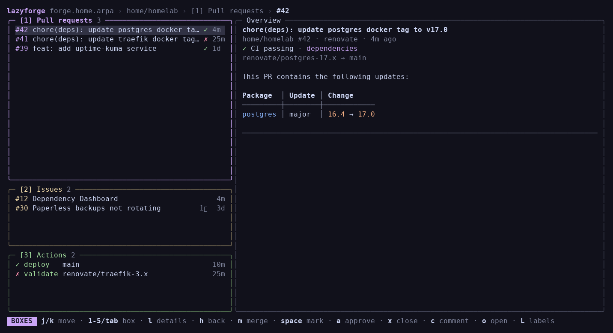
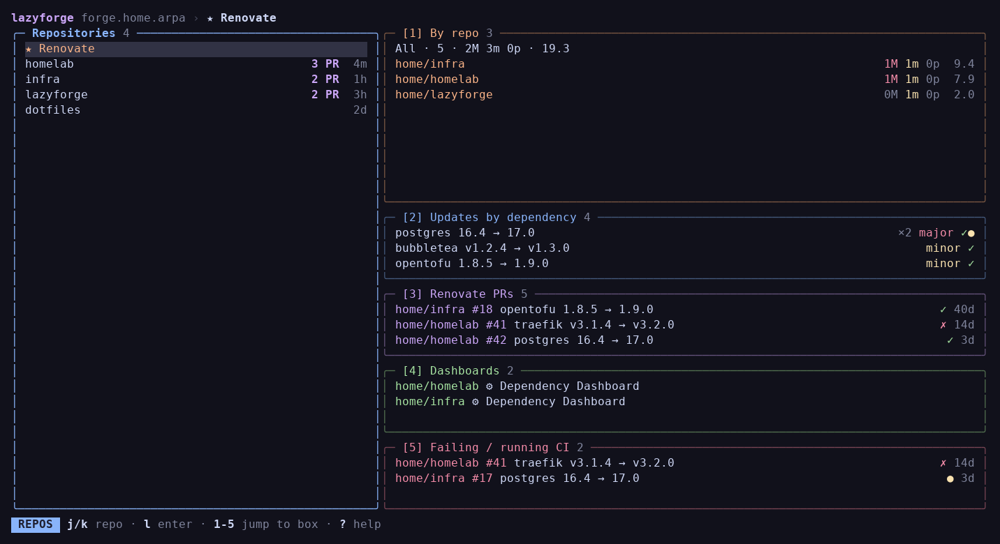

# lazyforge

A keyboard-driven terminal UI for your git forge: pull requests, issues, Actions, releases and Renovate, with vim keys throughout.

[lazygit](https://github.com/jesseduffield/lazygit) handles the git side of your work. lazyforge handles the forge side: everything that lives on the server.

**Status:** v1 is implemented for **Forgejo and Gitea**. GitHub and GitLab adapters are planned. Build from source today; no releases have been published yet.



## What it does

- Browse repositories in columns, then step into pull requests, issues, Actions, Renovate updates and releases.
- Read PR and issue bodies, diffs and comments; merge or approve PRs, close items, edit labels and post comments.
- Inspect CI runs and job logs, and open run pages in your browser.
- Use the cross-repo **★ Renovate** view to group updates by dependency, inspect failing CI, merge updates across repositories and tick Dependency Dashboard entries.
- Configure multiple hosts and connect to one per session.

## Install from source

Requires Git, Go **1.27.2 or newer** (the version in [go.mod](go.mod)), and `make`.

```bash
git clone https://git.bobparsons.dev/deadstyle/lazyforge.git
cd lazyforge
make build
./bin/lazyforge -demo
```

The binary is `bin/lazyforge`. To put it on your `PATH`:

```bash
mkdir -p ~/.local/bin
install -m 0755 bin/lazyforge ~/.local/bin/lazyforge
```

Make sure `~/.local/bin` is on your `PATH`, then run `lazyforge` from any directory.

## Try the demo

```bash
lazyforge -demo
```

Demo mode uses built-in sample repositories, PRs, issues, CI runs and releases. It needs no account, token or config and does not connect to a forge. Merge, approve, close and dashboard actions update the in-memory demo data; restart to reset it. Browser actions still open the sample URLs.



Both screenshots show the running demo at 140×34 terminal cells. Start on **★ Renovate**, or press `j` to select `homelab` and `l` to explore its PRs.

## Connect your forge

Run `lazyforge` without `-demo`. With no config file, first-run onboarding walks you through:

1. Choosing Forgejo or Gitea and entering your server address.
2. Pasting an access token or supplying a command that prints one, then testing the connection.
3. Setting the Renovate bot username (leave blank to skip) and a short host name.

Create a token at your server's `/user/settings/applications` page with `read:user`, `write:repository` and `write:issue`, as shown in onboarding. These cover sign-in, repositories, PRs, CI, issues and the actions above.

Onboarding saves `config.toml` with mode `0600`. On Linux the default path is `~/.config/lazyforge/config.toml`; on macOS it is `~/Library/Application Support/lazyforge/config.toml`. `XDG_CONFIG_HOME` overrides the base directory on either platform. A pasted token is stored in that file; a token command is stored instead when you choose that option.

Press `S` for settings to add or edit hosts. To select a configured host or use another config file:

```bash
lazyforge -host home
lazyforge -config /path/to/config.toml
```

Use `lazyforge -help` for all flags, `-version` to print the build version, or `-no-update-check` to skip the startup release check.

## Keys

| Key | Action |
|---|---|
| `j` / `k`, ↓ / ↑ | Move through a list |
| `l` / `h`, → / ← | Enter / go back |
| `1`–`5` | Jump to a numbered box |
| `Tab` / `Shift+Tab` | Next / previous box |
| `[` / `]` | Switch detail tabs |
| `Space` | Mark an item for a bulk action |
| `r` | Refresh |
| `S` | Settings (connected mode) |
| `?` | Show the full, context-sensitive keymap |
| `q` | Quit |

Available actions and their keys appear in the footer and help overlay.

## Development

In addition to Go and `make`, `make check` requires `golangci-lint` v2 and ShellCheck. CI pins their versions in [the setup action](.forgejo/actions/setup/action.yml).

```bash
make check   # format check, lint, race-enabled tests, vulnerability scan, build, installer checks
make run     # build and start the app
```

- [Design](docs/design.md): UI model, navigation, keymap and Renovate features
- [Architecture](docs/architecture.md): core/adapter split, domain model, host config and API mapping
- [Interactive mockup](docs/mockup.html): design reference; open in a browser and use vim keys
- [Decision records](docs/adr/): why the big technical calls were made
- [Agent guide](CLAUDE.md): ticket, review and MR workflow

## License

[MIT](LICENSE).
